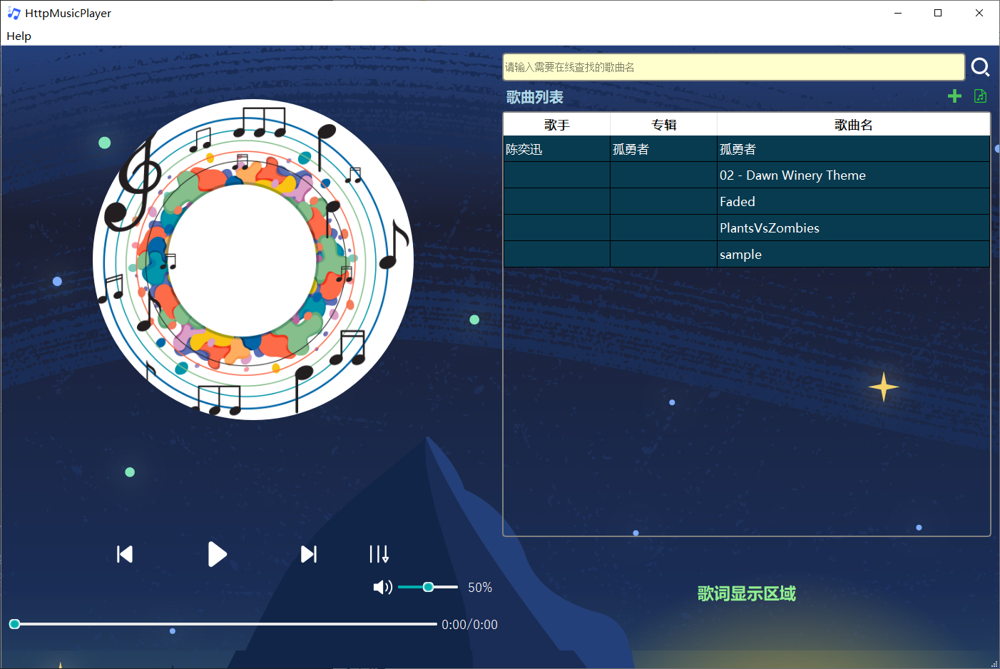

### 1. 系统结构
HttpMusicPlayer文件夹为Http在线音乐播放器的项目文件夹。

以下对Http在线音乐播放器的相关内容进行说明与解释：

①HttpMusicPlayer为主窗口类，负责UI界面的显示与用户互动的处理。

②MessageBoxHandler用于实现用户交互时弹出显示的MessageBox的内容处理与内容显示。

③MenuBarHandler用于实现用户交互时显示的下拉菜单的内容处理与内容显示。

④musicmodel.h中定义了歌曲列表（QTableView实现）的数据模型，用于歌手，歌曲，专辑名的管理与显示。

⑤song.h中定义了一首歌曲的数据结构，包括文件路径，相关名称等等，便于实现歌曲的管理。

⑥trayicon.h中定义了一个单例模式实现的最小化托盘的实现类，用于最小化托盘相关功能的实现。

⑦LyricManager用于歌曲歌词的载入与显示。

⑧FileManager用于json文件的处理，在线歌曲文件的获取，本地文件的导入等等文件功能。

⑨common.h文件中包含有关数据结构的定义、有关路径的定义等等。

⑩utils.h文件为一个工具类文件，定义了一些字符串处理的工具函数，便于其他文件调用。

其他类与各个类具体的实现可见项目中.h文件与.cpp文件，本文档中不再赘述。

### 2. 基本流程（使用方法）

本音乐播放器启动后的基本UI界面如下图所示（自动导入了songs文件夹中的歌曲）。

①在线歌曲的搜索与下载：右上角的黄色搜索框可以进行在线歌曲的查找与下载，当用户输入的查找内容在gitee仓库中存在对应的歌曲（符合模糊匹配），会出现对应的搜索词供用户选择，如果不存在则不会提示。在线歌曲（包括json文件与对应的资源文件）会被下载到本地。

②本地歌曲的手动导入：用户可以通过以下两种方式导入本地歌曲。

1.一种方式为点击如下图所示的按钮，再在本地选择json文件（该文件需要与仓库中的json文件格式相同），便可导入json文件中对应的歌曲。

2.另一种方式为点击如下图所示的按钮，选择单独的一个音频文件，便可导入该音频文件，但是单独的一个音频文件无法在启动时自动导入。

③ 其他播放器的基本功能不需要过多的说明，在此不再赘述，具体可见下图，在列表中双击选择歌曲即可播放。

tips:
1. 音乐资源文件夹在一个专门的文件夹中（./songs），可以在common.h文件夹中进行资源路径的设置
2. 播放器应该可以直接在release文件夹中找到对应的exe文件进行使用。
3. 使用了LAV Filters作为音频编解码过滤器以支持更多的格式，在不同的环境中可能需要下载。

### 3. 功能说明

本项目完成了以下功能：

    a. 基本需求
        ▪ 支持MP3格式音乐播放
        ▪ 支持基本的播放控制功能，如播放、暂停、上一曲、下一曲
        ▪ 支持在线音乐播放，通过HTTP请求获取音乐资源
        ▪ 支持歌词自动匹配并显示
        ▪ 支持专辑图片自动匹配并显示
        ▪ 支持音量调节、静音功能
        ▪ 支持播放进度显示,时间显示
        ▪ 支持歌曲切换
    b.扩展需求
        ▪ 支持拖动进度条调整进度
        ▪ 支持专辑图片动画,在播放时可同步旋转
        ▪ 支持本地音乐缓存与播放（包括json文件的导入和单独音频文件的导入）
        ▪ 支持MP3以外的格式播放,如WAV、FLAC、AAC格式等
        ▪ 支持播放模式选择，如顺序播放、单曲循环、随机播放等
        ▪ 支持最小化托盘
        ▪ 支持gitee仓库的资源作为在线歌曲搜索的候选项

为更好地演示本播放器的功能，录制了演示视频，存放在本目录的videos文件夹中，名称为example.mp4。

视频中展示了主要的相关功能，相关歌曲文件也可在项目文件夹中找到。

### 4. update notes
12/18: 正在制作一个基本的UI界面

12/21: 添加了一些功能的实现函数，但还没有整合起来

12/23: 继续完成功能实现函数，实现了简单的整合，TODO:架构优化

12/24: 完成了绝大多数功能，但是HTTP功能会报SSL错误，还未解决

12/25: 解决了SSL错误，基本完成了所有功能

12/26: 优化了一下系统的结构与UI界面

12/27: 完成了获取Gitee仓库中的相关名称作为搜索候选项，本地文件自动导入等等方便用户使用的功能

12/28: 完成README的编写，项目基本完成，还有一些想要加入的功能没时间写了